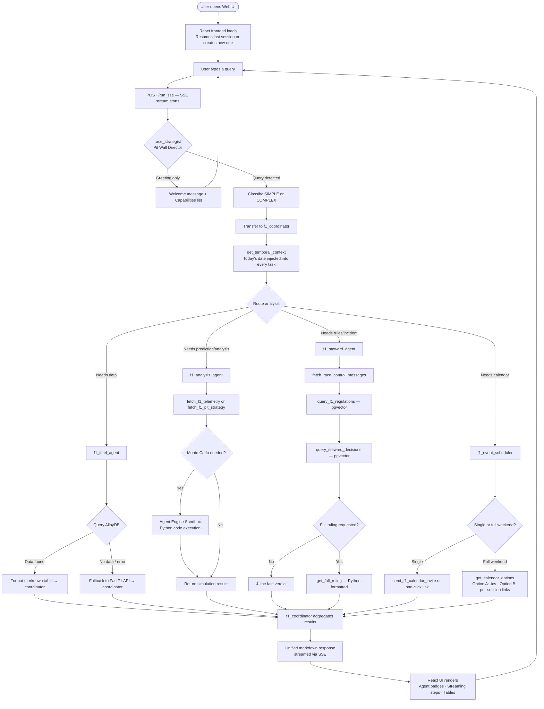
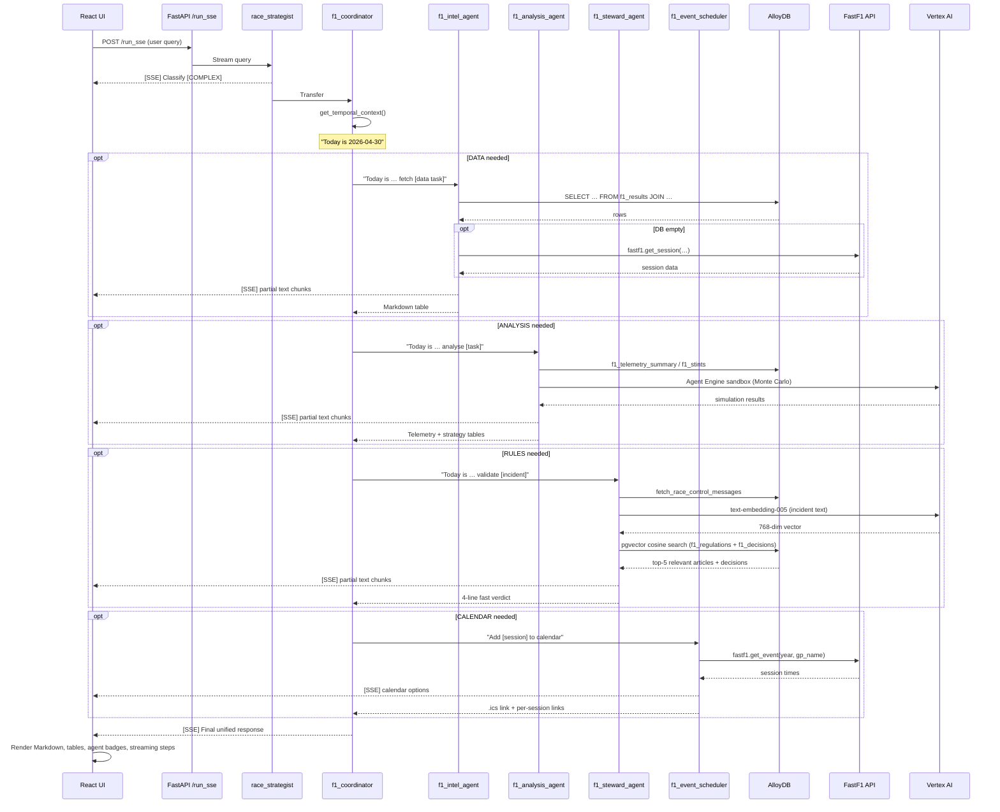

# 🏎️ F1 AI Orchestrator: Virtual Pit Wall

[](https://www.python.org/)
[](https://github.com/google/generative-ai-adk)
[](https://deepmind.google/technologies/gemini/)
[](https://cloud.google.com/alloydb)
[](https://react.dev/)
[](https://opensource.org/licenses/MIT)

A production-grade, two-tier multi-agent AI system for Formula 1 analysis — race telemetry, pit strategy, FIA regulation lookups, steward decision precedents, and Google Calendar scheduling — powered by **Google ADK**, **AlloyDB with pgvector RAG**, **FastF1**, **Vertex AI**, and a **React + Vite** frontend.

---


---

## 🏗️ Architecture

### System Layers

```
┌─────────────────────────────────────────────────────────────────────────────┐
│                          INFRASTRUCTURE LAYER                               │
│  Cloud Run (gen2, 4Gi)  ·  Vertex AI  ·  AlloyDB (PostgreSQL + pgvector)   │
└────────────────────────────────┬────────────────────────────────────────────┘
                                 │
┌────────────────────────────────▼────────────────────────────────────────────┐
│                         SERVING LAYER (FastAPI)                             │
│                                                                             │
│   POST /run_sse        ← SSE streaming endpoint (ADK)                       │
│   POST /apps/…/sessions← Session management (ADK + AlloyDB)                 │
│   GET  /health          ← Health check                                      │
│   GET  /ics/{year}/{gp} ← ICS calendar download                             │
└────────────────────────────────┬────────────────────────────────────────────┘
                                 │
┌────────────────────────────────▼────────────────────────────────────────────┐
│                    TIER 1 — ORCHESTRATOR                                    │
│                  race_strategist (Pit Wall Director)                        │
│         Greets user · Lists capabilities · Classifies [SIMPLE/COMPLEX]      │
└────────────────────────────────┬────────────────────────────────────────────┘
                                 │
┌────────────────────────────────▼────────────────────────────────────────────┐
│                    TIER 2 — COORDINATOR                                     │
│                   f1_coordinator (Race Engineer)                            │
│   1. Calls get_temporal_context() on every query                            │
│   2. Sequences: Intel → Analysis/Steward → Scheduler                        │
│   3. Shares data via ToolContext.state (no duplicate fetches)               │
│   4. Aggregates into one unified markdown response                          │
└──┬──────────┬──────────────┬───────────────────────────┬────────────────────┘
   │          │              │                           │
   ▼          ▼              ▼                           ▼
┌──────┐  ┌──────┐  ┌───────────────┐  ┌──────────────────────┐
│Intel │  │Anlys │  │FIA Steward    │  │Event Scheduler       │
│Agent │  │Agent │  │Panel          │  │                      │
│      │  │      │  │               │  │ get_f1_schedule      │
│·DB   │  │·Tele-│  │·query_f1_regs │  │ get_session_times    │
│·FastF1  │metry │  │·query_steward │  │ get_calendar_options │
│·Sched│  │·Stints  │·race_control  │  │ send_calendar_invite │
│·Stand│  │·FastF1  │·query_f1_db   │  └──────────┬───────────┘
│·Circ.│  │·DB   │  │·get_full_ruling              │
│·H2H  │  │·Stand│  └───────────────┘        Google Calendar
│      │  │·Monte│                            API + .ics File
└──┬───┘  │Carlo │
   │      └──────┘
   ▼
┌──────────────────────────────────────────────────────────────────┐
│                       DATA LAYER                                 │
│                                                                  │
│  AlloyDB PostgreSQL (f1db)       FastF1 API       Vertex AI      │
│  ─────────────────────────       ──────────       ──────────     │
│  f1_results    (~50k rows)       Live telemetry   Gemini 2.5     │
│  f1_sessions   (~260 rows)       Session data     Flash LLM      │
│  f1_drivers    (~100 rows)       Schedule         text-embed-005 │
│  f1_teams      (~20 rows)        Race results     Agent Engine   │
│  f1_standings  (~5k rows)                         (Monte Carlo)  │
│  f1_circuits   (~80 rows)                                        │
│  f1_telemetry_summary  (~10k+)                                   │
│  f1_stints     (~30k+)                                           │
│  f1_lap_summary (~500k+)                                         │
│  f1_race_control (~20k+)                                         │
│  f1_regulations (5,525 + 768-dim vectors + ScaNN)                │
│  f1_decisions   (664    + 768-dim vectors + ScaNN)               │
└──────────────────────────────────────────────────────────────────┘
```

---

### User Flow



---

### Sequence Diagram — Complex Multi-Agent Query



---

## 🖥️ User Interface

A modern F1-themed React + Vite frontend with real-time streaming.


**Features:**
- **Live agent steps** — shows routing and tool activity in real time (`→ Intelligence Officer` · `Querying AlloyDB…`)
- **Agent attribution badges** — colour-coded pills: `Intel` (blue) · `Analysis` (amber) · `Steward` (purple) · `Scheduler` (green)
- **Streaming responses** — text appears progressively as the model generates
- **Contextual follow-up chips** — year-aware suggestions after each response
- **Session persistence** — resumes last session via localStorage; `+ New Session` to reset
- **Copy button** on hover for every assistant response
- **Retry button** on connection errors

---

## 🎙️ The Specialist Roster

| Agent | Role | Temp | Key Tools |
|---|---|---|---|
| `race_strategist` | Classify + route only. Greets user. Never answers technical questions directly. | 0.0 | — |
| `f1_coordinator` | Sequences specialists, injects date context, aggregates results. | 0.3 | `get_temporal_context` |
| `f1_intel_agent` | Structured data retrieval — results, standings, circuits, head-to-head. | 0.0 | `query_f1_db` · `fetch_fastf1_live_data` · `get_f1_schedule` · `get_f1_standings` · `get_circuit_characteristics` · `get_driver_head_to_head` |
| `f1_analysis_agent` | Telemetry analysis, pit strategy, race predictions, Monte Carlo simulation. | 0.4 | `fetch_f1_telemetry` · `fetch_f1_pit_strategy` · `fetch_fastf1_live_data` · `query_f1_db` · `get_f1_standings` · `get_f1_schedule` · `AgentEngineSandboxCodeExecutor` |
| `f1_steward_agent` | FIA regulation lookup, steward precedent search, incident verdicts. | 0.0 | `query_f1_regulations` · `query_steward_decisions` · `fetch_race_control_messages` · `query_f1_db` · `get_full_ruling` |
| `f1_event_scheduler` | Google Calendar invites, .ics file generation. Always invoked last. | 0.0 | `get_f1_schedule` · `get_session_times` · `get_calendar_options` · `send_f1_calendar_invite` |

### Steward Agent — Progressive Disclosure
- **Fast verdict (default):** 4 lines in ~20s — `Finding / Article / Precedent / Likely Penalty`
- **Full ruling (on demand):** call `get_full_ruling` — formats complete FIA document in Python, no extra LLM generation
- **Confidence rules:** when no DB record found for the specific incident, outputs `INCONCLUSIVE` with clear data gap labels — never fabricates a VIOLATION/NO VIOLATION from model knowledge

---

## 💬 Example Queries

| Query | Route |
|---|---|
| "Who won the 2024 Monaco GP?" | Intel → `query_f1_db` |
| "Top 5 penalties in 2025" | Intel → `query_f1_db` GROUP BY |
| "Career head-to-head: Verstappen vs Hamilton" | Intel → `get_driver_head_to_head` |
| "Tell me about the Spa-Francorchamps circuit" | Intel → `get_circuit_characteristics` |
| "Analyse Norris vs Piastri telemetry at Monza 2024" | Analysis → `fetch_f1_telemetry` |
| "What's the optimal pit strategy for Monaco?" | Analysis → Monte Carlo simulation |
| "Was the pit release at 2024 Bahrain safe?" | Steward → 4-line fast verdict |
| "Show me the full ruling" | Steward → `get_full_ruling` |
| "Add the whole British GP weekend to my calendar" | Scheduler → Option A (.ics) or Option B (links) |
| "Predict the next race winner" | Coordinator → Intel + Analysis |
| "Was the incident legal? What's the standings impact?" | Coordinator → Steward + Intel |
| "Add next race to calendar and predict the winner" | Coordinator → Intel + Analysis + Scheduler |

---

## 🗄️ Data Layer

### AlloyDB Schema (f1db) — 12 tables

| Table | Description | Rows |
|---|---|---|
| `f1_results` | Race/qualifying results 2020–2026 | ~50k |
| `f1_sessions` | Session metadata (`session_type` = `'Race'` or `'Qualifying'`) | ~260 |
| `f1_drivers` | Driver registry (`driver_id` = 3-letter code e.g. `'VER'`) | ~100 |
| `f1_teams` | Constructor registry (`team_id` e.g. `'mercedes'`) | ~20 |
| `f1_standings` | Championship snapshots (`standing_type` = `'driver'` or `'constructor'`) | ~5k |
| `f1_circuits` | Circuit metadata + GPS coordinates | ~80 |
| `f1_telemetry_summary` | Pre-aggregated lap telemetry per driver/session | ~10k+ |
| `f1_stints` | Pit stop stint data per driver/session | ~30k+ |
| `f1_lap_summary` | Lap-by-lap validity + sector times | ~500k+ |
| `f1_race_control` | Flags, SC, VSC, penalties per session | ~20k+ |
| `f1_regulations` | FIA regulation chunks (2021–2026) + pgvector embeddings | 5,525 |
| `f1_decisions` | Steward decisions (2023–2026) + pgvector embeddings | 664 |

> **Key schema constraints:** `driver_id` = 3-letter code (TEXT) · `session_type` = `'Race'` or `'Qualifying'` only · `standing_type` = `'driver'` or `'constructor'` (lowercase) · `race_name` always queried with `ILIKE '%keyword%'`

### RAG Pipeline

```
FIA PDFs (17 files, 2021–2026)          OpenF1 Race Control Messages
         │                                         │
         ▼                                         ▼
scripts/ingest_regulations.py       scripts/build_steward_decisions.py
         │  chunk by article (≤4000 chars)          │  parse penalty records
         │  embed: text-embedding-005 (768-dim)      │  embed: text-embedding-005
         ▼                                         ▼
AlloyDB: f1_regulations (5,525 rows)   AlloyDB: f1_decisions (664 rows)
ScaNN index (cosine, num_leaves=50)    ScaNN index (cosine, num_leaves=30)
         │                                         │
         └──────────────────┬────────────────────┘
                            │
              At query time (f1_steward_agent):
              1. Embed question via Vertex AI text-embedding-005
              2. Path A: direct article number regex match (e.g. Article 34.14)
              3. Path B: cosine similarity — embedding <=> query_vector, top-5
              4. LLM synthesises verdict from retrieved context
```

### Data Access Cache Strategy

```
Query → ToolContext.state (in-memory, per session)
      → AlloyDB (primary — pre-aggregated)
      → FastF1 API (live fallback)
      → Write-back to AlloyDB (ON CONFLICT DO NOTHING, for future hits)
```

---

## 🛠️ Tech Stack

| Component | Technology |
|---|---|
| Agent Framework | Google ADK 1.28.1 |
| LLM | Gemini 2.5 Flash (retry: 429/503, 3 attempts, 2s→32s exponential backoff) |
| Frontend | React 19 + Vite 6 (F1-themed, SSE streaming) |
| Serving | FastAPI via `get_fast_api_app()` |
| Deployment | Cloud Run (gen2, 4Gi) |
| Database | AlloyDB for PostgreSQL + pgvector + ScaNN |
| Vector Search | AlloyDB ScaNN (cosine similarity, sub-millisecond) |
| Embeddings | Vertex AI `text-embedding-005` (768-dim) |
| Telemetry | FastF1 3.8.2 |
| FastF1 Cache | `/tmp/fastf1_cache` (Cloud Run ephemeral) |
| Monte Carlo | Agent Engine Sandbox (Vertex AI Reasoning Engine) |
| Calendar | Google Calendar API + `.ics` file generation |
| Session Storage | ADK `DatabaseSessionService` (AlloyDB + asyncpg) |
| DB Connection Pool | `psycopg2.ThreadedConnectionPool` (min=2, max=10) |

### Performance Characteristics

| Operation | Latency | Notes |
|---|---|---|
| AlloyDB SELECT (indexed) | <100ms | Structured queries with proper indexes |
| pgvector ScaNN search | <1ms | Sub-millisecond per spec |
| Vertex AI embedding | ~1–2s | Per text-embedding-005 call |
| FastF1 API live fetch | 5–30s | Cold start; cached after first call |
| Steward fast verdict | ~20s | 3 tool calls + LLM synthesis |
| Full ruling (cached) | Instant | `get_full_ruling` is pure Python |
| Monte Carlo simulation | Variable | Agent Engine sandbox execution |

---

## 🚀 Getting Started

### Environment
Create a `.env` file:
```bash
# GCP
GOOGLE_CLOUD_PROJECT=your-project-id
GOOGLE_GENAI_USE_VERTEXAI=1
GOOGLE_CLOUD_LOCATION=us-central1
REGION=us-central1

# AlloyDB
ALLOYDB_HOST=your-alloydb-ip
ALLOYDB_PORT=5432
ALLOYDB_DATABASE=f1db
ALLOYDB_USER=postgres
ALLOYDB_PASSWORD=your-password
ALLOYDB_CLUSTER=your-cluster
ALLOYDB_INSTANCE=your-instance

# FastF1 cache
FASTF1_CACHE_DIR=/tmp/fastf1_cache

# RAG
GCS_REGULATIONS_BUCKET=your-project-f1-regulations

# User
USER_EMAIL=your-email@gmail.com
```

### Local Development

```bash
# Backend
pip install -r requirements.txt
python main.py

# Frontend (separate terminal)
cd f1-ui && npm install && npm run dev
# UI: http://localhost:5173  →  API: live Cloud Run service
```

### Deploy to Cloud Run
```bash
gcloud builds submit --tag gcr.io/YOUR_PROJECT/f1-orchestrator:latest .

sed 's|IMAGE_PLACEHOLDER|gcr.io/YOUR_PROJECT/f1-orchestrator:latest|g' \
  cloudrun-service.yaml | gcloud run services replace - --region us-central1
```

### Live Service
- **Endpoint:** `https://f1-orchestrator-521055768390.us-central1.run.app`
- **Health:** `/health`
- **ICS Calendar:** `GET /ics/{year}/{gp_name}` — e.g. `/ics/2026/Miami`

### Database Setup
```bash
# Schema DDL + ScaNN indexes
python scripts/run_migrations.py
python scripts/run_migrations.py --indexes

# FastF1 → CSVs → AlloyDB (rate-limit safe two-step)
python scripts/download_fastf1_to_csv.py --seasons 2020 2021 2022 2023 2024 2025
python scripts/load_csv_to_alloydb.py --years 2020 2021 2022 2023 2024 2025

# FIA regulations (upload PDFs to GCS first)
python scripts/ingest_regulations.py

# Steward decisions from OpenF1
python scripts/build_steward_decisions.py
```

---

## 📁 Project Structure

```
f1-ai-orchestrator/
├── f1_orchestrator/
│   ├── agent.py          # All tools + all agents
│   ├── schema.py         # AlloyDB table metadata + verified join patterns
│   └── data_dictionary.md
├── f1-ui/                # React + Vite frontend (local dev)
│   ├── src/
│   │   ├── App.jsx       # Chat state, session lifecycle, SSE handling
│   │   ├── api.js        # createSession() + streamMessage() with agent step parsing
│   │   ├── components/
│   │   │   ├── Header.jsx
│   │   │   ├── MessageList.jsx
│   │   │   ├── MessageBubble.jsx  # Agent badges, copy, retry, follow-up chips
│   │   │   └── InputBar.jsx
│   │   └── styles/theme.css       # F1 dark theme (#E8002D, carbon black)
│   └── .env.local        # VITE_API_URL, VITE_USER_ID
├── scripts/
│   ├── run_migrations.py
│   ├── download_fastf1_to_csv.py
│   ├── load_csv_to_alloydb.py
│   ├── ingest_regulations.py
│   └── build_steward_decisions.py
├── cloudrun-service.yaml
├── main.py               # FastAPI entry + /ics endpoint + CORS config
├── Dockerfile
└── requirements.txt
```

---

## 🛡️ Security & IAM

| Role | Purpose |
|---|---|
| `roles/aiplatform.user` | Vertex AI embeddings + Agent Engine |
| `roles/alloydb.client` | AlloyDB connection |
| `roles/storage.objectAdmin` | GCS cache + regulations bucket |
| `roles/secretmanager.secretAccessor` | AlloyDB password, OAuth secrets |

**Controls:** SQL injection prevention via blocked keyword allowlist + parameterised queries · Read-only enforcement on `query_f1_db` · CORS restricted to `localhost:[0-9]+` for local dev · Calendar auth via ADC with per-call credential refresh.

---

## 📈 Data Dictionary

Full schema reference: [f1_orchestrator/data_dictionary.md](./f1_orchestrator/data_dictionary.md)
