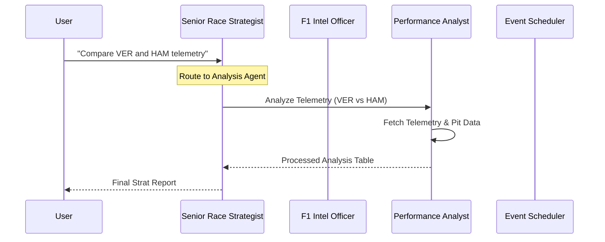

# 🏎️ F1 AI Orchestrator: Virtual Pit Wall

[](https://www.python.org/)
[](https://cloud.google.com/)
[](https://opensource.org/licenses/MIT)
[](https://deepmind.google/technologies/gemini/)

A high-performance, multi-agent AI system designed to provide professional-grade F1 race strategy, historical analysis, and live telemetry orchestration. Powered by **Google GenAI ADK**, **AlloyDB**, and **FastF1**.

---


---

## 🏗️ System Architecture

The project utilizes a specialized **Multi-Agent Swarm** coordinated by a central Orchestrator. This ensures high precision by routing technical, analytical, and scheduling tasks to dedicated specialists.



---

## 🎙️ The Specialist Roster

### 1. **Senior Race Strategist (Orchestrator)**
*   **Role**: The Pit Wall Director.
*   **Job**: Manages the specialist swarm. Routes incoming requests to the appropriate agent to ensure zero-latency routing and high-fidelity output.
*   **Logic**: Uses sophisticated routing rules to prevent agent "looping" and ensures all data is presented in professional pit-wall formatting.

### 2. **F1 Intelligence Officer (Intel Agent)**
*   **Role**: The Source of Truth.
*   **Job**: Owns all raw data retrieval. Queries **AlloyDB** for historical stats (2020-2026) and falls back to **FastF1** for live session results.
*   **Specialty**: Historical results, championship standings, race winners, and circuit schedules.

### 3. **Performance Analyst (Analysis Agent)**
*   **Role**: The Data Scientist.
*   **Job**: Processes high-frequency telemetry (Speed, Throttle, RPM) and pit stop strategy.
*   **Tools**: Self-sufficient retrieval of car telemetry and tyre compounds to produce head-to-head comparisons and race predictions.

### 4. **Event Scheduler (Calendar Agent)**
*   **Role**: User Experience Lead.
*   **Job**: Synchronizes the F1 calendar with your Google Calendar.
*   **Magic**: Automatically formats session times into ISO 8601 and handles "Direct-Write" invite delivery.

---

## 📊 Technical Capabilities

*   **Telemetry Swarm**: Real-time analysis of Speed, Throttle, Brake, Gear, and RPM from the fastest laps.
*   **Pit Intelligence**: Detailed stint reviews, compound analysis, and undercut/overcut detection.
*   **AlloyDB Recall**: Ultra-fast querying of historical F1 data using a dedicated PostgreSQL-compatible cluster.
*   **Smart Calendar**: Intelligent fallback system that provides a **One-Click Link** if direct calendar write permissions are absent.

---

## 🛠️ Tech Stack

*   **Framework**: [Google GenAI ADK](https://github.com/google/generative-ai-adk) + FastAPI.
*   **LLM**: Gemini 2.5 Flash for high-speed agentic reasoning.
*   **Database**: Google Cloud AlloyDB for historical 2020–2026 technical data.
*   **Data Libs**: [FastF1](https://github.com/theOehrly/Fast-F1) for telemetry and technical modelling.
*   **Compute**: Google Cloud Run (Containerized Deployment).

---

## 🚀 Getting Started

### 1. Environment Configuration
Create a `.env` file in the root directory:
```bash
# GCP & AlloyDB
PROJECT_ID=your-project-id
REGION=us-central1
ALLOYDB_HOST=your-ip
ALLOYDB_PASSWORD=your-password

# User Context
USER_EMAIL=your-email@gmail.com
```

### 2. Local Setup
```bash
# Install dependencies
pip install -r requirements.txt

# Run the backend
python main.py
```

### 3. Deployment
```bash
# Deploy to Google Cloud Run
gcloud run deploy f1-orchestrator --source . --region us-central1
```

---

## 🏎️ Usage Gallery

> **"Analyze the telemetry for Verstappen and Hamilton at the Miami GP."**
> 
> *Response includes a detailed side-by-side table of Corner Speed, Throttle Application, and RPM efficiency.*

> **"When is the next race and add it to my calendar."**
> 
> *The bot finds the upcoming GP, formats the time, and sends a direct invite to your inbox.*

> **"Who led the 2025 Driver Standings?"**
> 
> *Direct SQL lookup from AlloyDB for instant, historical accuracy.*

---

## 📈 Data Governance
Technical details on the underlying AlloyDB schema and table metadata can be found in the [Data Dictionary](./f1_orchestrator/data_dictionary.md).

---

## 🛡️ Security & IAM
Ensure the Service Account running the application has the following roles:
*   `roles/alloydb.client`
*   `roles/aiplatform.user`
*   `roles/logging.logWriter`

For Calendar integration, share your primary calendar with the Service Account email with **"Make changes to events"** permissions.
