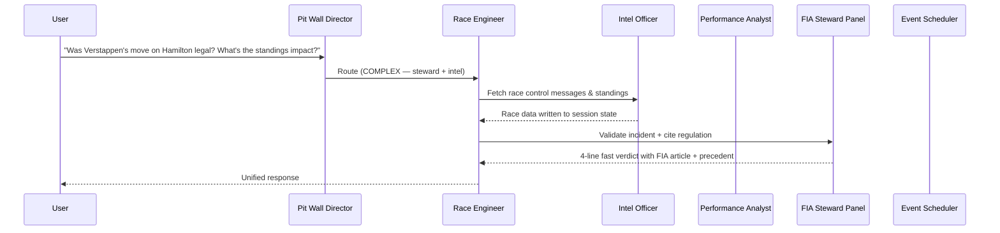

# 🏎️ F1 AI Orchestrator: Virtual Pit Wall

[](https://www.python.org/)
[](https://github.com/google/generative-ai-adk)
[](https://deepmind.google/technologies/gemini/)
[](https://cloud.google.com/alloydb)
[](https://opensource.org/licenses/MIT)

A two-tier, multi-agent AI system that delivers professional-grade F1 analysis — race telemetry, pit strategy, FIA regulation lookups, steward decision precedents, and Google Calendar scheduling — powered by **Google ADK**, **AlloyDB with pgvector RAG**, **FastF1**, and **Vertex AI**.

---


---

## 🏗️ Architecture

A two-tier agent hierarchy routes every query to the right specialist or sequences multiple specialists for complex cross-domain questions.

```
User Query
    │
    ▼
race_strategist  (Tier 1 — Pit Wall Director)
    │  Classifies complexity, routes to coordinator
    ▼
f1_coordinator   (Tier 2 — Race Engineer)
    │  Calls get_temporal_context first on every query
    │  Single specialist for simple queries
    │  Sequences multiple agents for complex queries
    │  Shares data between agents via ToolContext.state
    ├──► f1_intel_agent      — results, standings, circuits, head-to-head
    ├──► f1_analysis_agent   — telemetry, pit strategy, Monte Carlo simulation
    ├──► f1_steward_agent    — FIA regulations RAG, steward decision precedent
    └──► f1_event_scheduler  — Google Calendar invites (always isolated)
```



---

## 🎙️ The Specialist Roster

### 1. Pit Wall Director (Orchestrator)
Classifies every query as `[SIMPLE]` or `[COMPLEX]`. Never answers directly — only routes. Adds a one-line hint before passing to the coordinator.

### 2. Race Engineer (Coordinator)
Always calls `get_temporal_context` first so every specialist receives the current date. Sequences specialists in the correct order, passes shared data through `ToolContext.state` to avoid duplicate FastF1 fetches, and aggregates results into one unified response with structured markdown output.

### 3. F1 Intelligence Officer
Owns all structured data retrieval. Queries AlloyDB first, falls back to FastF1 live. Returns clean markdown tables — never raw Python tuples. Validates head-to-head comparisons with explicit database season coverage labels.

**Tools:** `query_f1_db` · `fetch_fastf1_live_data` · `get_f1_schedule` · `get_f1_standings` · `get_circuit_characteristics` · `get_driver_head_to_head`

### 4. Performance Analyst
Fetches telemetry, pit strategy, and weather data to produce structured analysis tables and race predictions. Includes a **Monte Carlo pit strategy simulator** powered by Agent Engine.

**Tools:** `fetch_f1_telemetry` · `fetch_f1_pit_strategy` · `fetch_f1_technical_details` · `fetch_fastf1_live_data` · `query_f1_db` · `AgentEngineSandboxCodeExecutor`

### 5. FIA Steward Panel
Validates racing incidents against FIA regulations using **pgvector semantic search** over 5,525 regulation chunks (2021–2026) and 664 historical steward decisions (2023–2026). Uses **progressive disclosure**:

- **Fast verdict (default):** 4 lines returned in ~20s — Finding / Article / Precedent / Likely Penalty
- **Full ruling (on demand):** when the user asks "show me the full ruling", calls `get_full_ruling` which formats the complete document in Python (no extra LLM token generation)

Both paths use `ToolContext.state` caching — follow-up full ruling calls are instant (no new DB queries).

**Tools:** `query_f1_regulations` · `query_steward_decisions` · `fetch_race_control_messages` · `query_f1_db` · `get_full_ruling`

### 6. Event Scheduler
Discovers F1 sessions and presents two calendar options:
- **Option A:** Single `.ics` file — imports all sessions at once into Google Calendar, Apple Calendar, or Outlook
- **Option B:** Individual `[Add to Calendar]` hyperlinks per session in a clean markdown table

**Tools:** `get_f1_schedule` · `get_session_times` · `get_calendar_options` · `send_f1_calendar_invite`

---

## 💬 Example Queries

| Query | Route |
|---|---|
| "Who won the 2024 Monaco GP?" | Intel Agent |
| "Tell me about the Spa circuit" | Intel Agent |
| "Career head-to-head: Verstappen vs Hamilton" | Intel Agent (with DB coverage disclaimer) |
| "Analyse Norris vs Piastri telemetry at Monza 2024" | Analysis Agent |
| "What's the optimal pit strategy for Monaco?" | Analysis Agent (Monte Carlo) |
| "Was the pit release at 2024 Bahrain safe?" | Steward Agent → 4-line fast verdict |
| "Show me the full ruling" | Steward Agent → `get_full_ruling` (Python-formatted) |
| "Top 5 most common penalties in 2025" | Intel Agent (frequency GROUP BY query) |
| "Add the whole British GP weekend to my calendar" | Scheduler → Option A (.ics) or Option B (table links) |
| "Telemetry AND championship standings for 2024 Bahrain" | Coordinator → Intel + Analysis |
| "Was the incident legal? What's the standings impact?" | Coordinator → Intel + Steward |
| "Add next race to calendar and predict the winner" | Coordinator → Intel + Analysis + Scheduler |

---

## 🗄️ Data Layer

### AlloyDB Schema (f1db)

| Table | Description | Rows |
|---|---|---|
| `f1_results` | Race/qualifying results 2020–2026 | ~50k |
| `f1_sessions` | Session metadata (`session_type` = `'Race'` or `'Qualifying'`) | ~260 |
| `f1_drivers` | Driver registry (`driver_id` = 3-letter code e.g. `'VER'`) | ~100 |
| `f1_teams` | Constructor registry (`team_id` e.g. `'mercedes'`) | ~20 |
| `f1_standings` | Championship snapshots (`standing_type` = `'driver'` or `'constructor'`) | ~5k |
| `f1_circuits` | Circuit metadata + coordinates | ~80 |
| `f1_telemetry_summary` | Pre-aggregated lap telemetry per driver/session | ~10k+ |
| `f1_stints` | Pit stop stint data per driver/session | ~30k+ |
| `f1_lap_summary` | Lap-by-lap validity + sector times | ~500k+ |
| `f1_race_control` | Flags, SC, VSC, penalties per session | ~20k+ |
| `f1_regulations` | FIA regulation chunks (2021–2026) + embeddings | 5,525 |
| `f1_decisions` | Steward decisions (2023–2026) + embeddings | 664 |

> **Key schema facts verified against live DB:**
> - `driver_id` in all tables = 3-letter code (TEXT), not UUID
> - `session_type` values: `'Race'` and `'Qualifying'` only
> - `standing_type` values: `'driver'` and `'constructor'` (lowercase)
> - `race_name` = full official multilingual names — always use `ILIKE '%keyword%'`
> - Tables that do NOT exist: `races`, `driver_standings`, `team_standings`, `race_results` (Ergast schema)

### RAG Pipeline
- **5,525 FIA regulation chunks** — Sporting, Technical, Financial, General regulations across 2021–2026 (17 PDFs), chunked by article and embedded with `text-embedding-005`
- **664 steward decisions** — parsed from OpenF1 race control messages (74 race weekends, 2023–2026), embedded and indexed
- **Dual-path lookup** in `query_f1_regulations`: direct article number match (e.g. `Article 34.14`) → falls through to semantic search if not found
- **ScaNN vector indexes** on both tables for sub-millisecond semantic search

---

## 🛠️ Tech Stack

| Component | Technology |
|---|---|
| Agent Framework | Google ADK 1.28.1 |
| LLM | Gemini 2.5 Flash (retry: 429/503, exponential backoff) |
| Serving | FastAPI via `get_fast_api_app()` |
| Deployment | Cloud Run (gen2, 4Gi) |
| Database | AlloyDB for PostgreSQL + pgvector + ScaNN |
| Vector Search | AlloyDB ScaNN (cosine similarity) |
| Embeddings | Vertex AI `text-embedding-005` (768-dim) |
| Telemetry | FastF1 3.8.2 |
| FastF1 Cache | `/tmp/fastf1_cache` (Cloud Run — SQLite incompatible with GCS FUSE random writes) |
| Monte Carlo | Agent Engine Sandbox (Vertex AI) |
| Calendar | Google Calendar API + `.ics` file generation |
| Connection Pool | `psycopg2.ThreadedConnectionPool` (min=2, max=10) |

---

## 🚀 Getting Started

### Environment
Create a `.env` file:
```bash
# GCP
GOOGLE_CLOUD_PROJECT=your-project-id
GOOGLE_GENAI_USE_VERTEXAI=1
GOOGLE_CLOUD_LOCATION=us-central1
REGION=us-central1

# AlloyDB
ALLOYDB_HOST=your-alloydb-ip
ALLOYDB_PORT=5432
ALLOYDB_DATABASE=f1db
ALLOYDB_USER=postgres
ALLOYDB_PASSWORD=your-password
ALLOYDB_CLUSTER=your-cluster
ALLOYDB_INSTANCE=your-instance

# FastF1 cache
FASTF1_CACHE_DIR=/tmp/fastf1_cache

# Phase 4 RAG
GCS_REGULATIONS_BUCKET=your-project-f1-regulations

# User
USER_EMAIL=your-email@gmail.com
```

### Local Development
```bash
pip install -r requirements.txt
python main.py
```

### Deploy to Cloud Run
```bash
# Build image
gcloud builds submit --tag gcr.io/YOUR_PROJECT/f1-orchestrator:latest .

# Deploy
sed 's|IMAGE_PLACEHOLDER|gcr.io/YOUR_PROJECT/f1-orchestrator:latest|g' \
  cloudrun-service.yaml | gcloud run services replace - --region us-central1
```

### Live Service
- **Endpoint:** `https://f1-orchestrator-521055768390.us-central1.run.app`
- **Health:** `https://f1-orchestrator-521055768390.us-central1.run.app/health`
- **ICS Calendar:** `GET /ics/{year}/{gp_name}` — e.g. `/ics/2026/Miami`

### Database Setup
```bash
# Apply schema migrations + ScaNN indexes
python scripts/run_migrations.py
python scripts/run_migrations.py --indexes

# Download FastF1 data to local CSVs (rate-limit safe)
python scripts/download_fastf1_to_csv.py --seasons 2020 2021 2022 2023 2024 2025

# Load CSVs into AlloyDB (no rate limiting — reads local files)
python scripts/load_csv_to_alloydb.py --years 2020 2021 2022 2023 2024 2025

# Ingest FIA regulations (upload PDFs to GCS first)
python scripts/ingest_regulations.py

# Build steward decisions from OpenF1
python scripts/build_steward_decisions.py
```

---

## 📁 Project Structure

```
f1-ai-orchestrator/
├── f1_orchestrator/
│   ├── agent.py          # All tools + all agents
│   ├── schema.py         # AlloyDB table metadata + verified join patterns
│   └── data_dictionary.md
├── data/                 # Pre-downloaded FastF1 CSVs (not committed)
│   ├── telemetry_summary.csv
│   ├── stints.csv
│   ├── lap_summary.csv
│   └── race_control.csv
├── fia_docs/             # FIA regulation PDFs (2021–2026, 17 files)
├── scripts/
│   ├── run_migrations.py              # Schema DDL + vector indexes
│   ├── download_fastf1_to_csv.py      # FastF1 → local CSVs (rate-limit safe)
│   ├── load_csv_to_alloydb.py         # CSV → AlloyDB (no API rate limits)
│   ├── backfill_telemetry.py          # Legacy: FastF1 direct → AlloyDB
│   ├── ingest_regulations.py          # FIA PDFs → pgvector
│   ├── build_steward_decisions.py     # OpenF1 decisions → pgvector
│   └── test_state_sharing.py          # ADK state propagation test
├── tests/
│   ├── test_agents.py
│   ├── test_db_tools.py
│   ├── test_fastf1_tools.py
│   ├── test_rag_tools.py
│   └── test_calendar_tools.py
├── cloudrun-service.yaml  # Cloud Run service spec
├── main.py                # FastAPI entry point + /ics endpoint
├── Dockerfile
└── requirements.txt
```

---

## 🛡️ Security & IAM

Required roles for the Cloud Run service account:

| Role | Purpose |
|---|---|
| `roles/aiplatform.user` | Vertex AI embeddings + Agent Engine |
| `roles/alloydb.client` | AlloyDB connection |
| `roles/storage.objectAdmin` | GCS cache + regulations bucket |
| `roles/secretmanager.secretAccessor` | AlloyDB password, OAuth secrets |

---

## 📈 Data Dictionary

Full schema reference: [f1_orchestrator/data_dictionary.md](./f1_orchestrator/data_dictionary.md)
